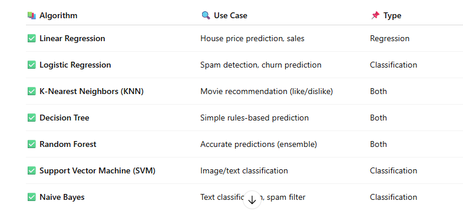

# Traditional_ML_Repo

A repository demonstrating classic machine learning algorithms—**KNN** and **Random Forest**—applied to both **classification** and **regression** tasks using the MovieLens dataset.

---

## Overview

This project explores:
What is Supervised Learning?
A type of machine learning where the model is trained using labeled data — that means input (X) is provided along with the correct output (y).

Labeled data ?
Labeled data woh data hota hai jisme input ke saath output bhi diya hota hai.
Tumhare paas sirf features (X) nahi, balki uska correct answer (y) bhi hota hai

Family of Supervised Learning contains these models -



1. **K-Nearest Neighbors (KNN)**  
   - **Classifier**: Predict whether a user *likes* a movie (rating ≥ 4)  
   - **Regressor**: Predict the *actual rating* a user gives (continuous value)

2. **Random Forest**  
   - **Classifier**: Same like/dislike binary task  
   - **Regressor**: Predict exact rating value

3. **Decision tree**  
   - **Classifier**: Same like/dislike binary task  
   - **Regressor**: Predict exact rating value

Evaluation metrics: accuracy (for classifiers) and MSE (for regressors)
---

## Getting Started

1. **Clone the repo**  
   ```bash
   git clone https://github.com/shantanu23-case/Traditional_ML_Repo.git
   cd Traditional_ML_Repo
